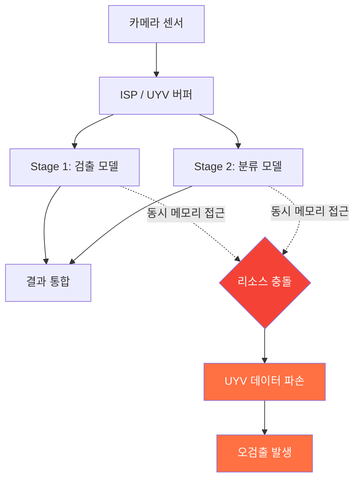

# CS1 · SoC 레지스터 제어로 비전 데이터 무결성 확보

> **핵심 메시지**: 소프트웨어 레이어에서 해결이 안 되면, 하드웨어로 내려간다.

---

## 요약

| 항목 | 내용 |
|---|---|
| **환경** | Edge SoC (Eyenix EN675/EN683), 다단 추론(Multi-stage Inference) |
| **문제** | 리소스 충돌로 인한 UYV 영상 데이터 파손 |
| **해결** | SoC 레지스터 직접 제어 — 메모리 접근 타이밍 최적화 |
| **성과** | 영상 데이터 깨짐 현상 근본 해결, 오검출 원천 차단 |

---

## 1. 상황 (Context)

제조 라인용 비전 검사 시스템에서 **다단 추론(Multi-stage Inference)** 을 운영 중이었습니다.
Stage 1(검출) → Stage 2(분류)로 이어지는 파이프라인에서 두 모델이 동시에 SoC 리소스에 접근하며
간헐적으로 **UYV 영상 데이터가 파손(corruption)** 되는 현상이 발생했습니다.

현상은 무작위적으로 재현되었고, 라인 가동 중 갑작스러운 오검출(False Positive)로 이어졌습니다.

---

## 2. 문제 분석 (Problem)

초기 접근은 **소프트웨어 레벨 우회** — 버퍼 재할당, 재시도 로직, 타임아웃 조정 — 이었습니다.
그러나 이 방법은 증상을 줄이는 데 그쳤고, 간헐적 데이터 파손은 완전히 사라지지 않았습니다.

근본 원인을 분석한 결과: **SoC 내부 메모리 접근 타이밍 제어가 소프트웨어 레이어에서 보장되지 않음**.
ISP와 NPU가 동일 메모리 영역에 non-deterministic 타이밍으로 접근하는 하드웨어 레벨의 문제였습니다.

---

## 3. 해결 (Action)

소프트웨어 우회를 포기하고 **SoC 레지스터 직접 제어** 방식으로 전환했습니다.

구체적 조치:

- SoC 데이터시트에서 메모리 접근 제어 관련 레지스터 맵 분석
- ISP 캡처 완료 → NPU 접근 허용 시퀀스를 레지스터 플래그로 강제화
- 소프트웨어에서 폴링하는 방식 대신 하드웨어 인터럽트 기반으로 동기화 재설계

---

## 4. 성과 (Result)

| 지표 | 개선 전 | 개선 후 |
|---|---|---|
| 데이터 파손 발생 | 간헐적 (무작위 재현) | **0건** |
| 오검출(FP)률 | 파손 발생 시 급등 | **정상 수준 유지** |
| 추가 소프트웨어 오버헤드 | 재시도·타임아웃 로직 | **없음** |

---

## 5. 핵심 학습

!!! note "엔지니어링 원칙"
    소프트웨어로 해결하려는 시도가 반복되면, 그 시도 자체가 하드웨어 레이어에 문제가 있다는 신호다.
    레지스터 수준으로 내려가면 복잡한 소프트웨어 로직이 단순한 타이밍 제어로 치환된다.

---

## SDF 연관성

현대차 **SDF(Software Defined Factory)** 에서 NPU/ISP 파라미터 조정, 모델 교체, 라인 재구성의 빠른 사이클은
결국 하드웨어와 소프트웨어의 인터페이스를 정확히 이해하는 엔지니어를 필요로 합니다.
이 경험은 SoC 레지스터 제어 역량이 단순 디버깅을 넘어 **SDF 추론 파이프라인 안정성 보장**에 직접 기여함을 보여줍니다.
