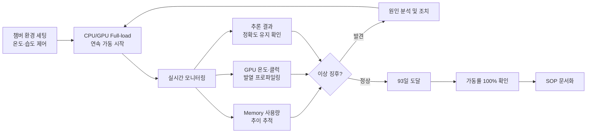

# CS2 · 93일 에이징 테스트 — 가동률 100% 달성

> **핵심 메시지**: 현장 투입 전, 라인보다 먼저 실패하게 만든다.

---

## 요약

| 항목 | 내용 |
|---|---|
| **환경** | Edge 비전 시스템, 챔버 환경 (CPU/GPU Full-load) |
| **목표** | 24/7 무중단 가동 신뢰성 검증 — 양산 현장 투입 전 |
| **기간** | 93일 연속 가동 |
| **성과** | 가동률 100% 달성, 양산 현장 SOP 수립 |

---

## 1. 상황 (Context)

비전 검사 시스템의 양산 현장 투입을 앞두고, **24/7 무중단 가동 신뢰성** 을 사전에 입증해야 했습니다.
제조 라인에서의 장애는 라인 전체 정지(Line-stop)로 이어지기 때문에,
현장 투입 전에 모든 잠재적 장애 모드를 발견하고 제거하는 것이 핵심 목표였습니다.

---

## 2. 에이징 테스트 설계 (Action)

**모니터링 항목**:

| 항목 | 수집 방법 | 임계값 기준 |
|---|---|---|
| Memory Leak | 프로세스 메모리 사용량 시계열 추적 | 선형 증가 여부 |
| GPU 온도 | tegrastats / 내부 센서 | TDP 기준 열 설계 마진 |
| CPU 클럭 스로틀링 | perf 카운터 | 클럭 다운 발생 여부 |
| 추론 지연시간 | 파이프라인 타임스탬프 로그 | 사이클타임 초과 여부 |
| 프로세스 크래시 | 워치독 + 재시작 카운터 | 0회 목표 |

---

## 3. 발견 및 조치

에이징 기간 중 발견된 이슈들을 유형별로 분류하고 현장 투입 전 모두 조치했습니다.

!!! warning "발견된 이슈 유형"
    - 장기 가동 시 특정 모듈의 메모리 사용량 완만한 증가 → 버퍼 해제 로직 누락 확인 및 수정
    - 고온 환경에서 간헐적 GPU 클럭 스로틀링 → 쿨링 설계 조정 및 열 마진 확보
    - 외부 트리거 신호 지연 시 추론 파이프라인 블로킹 → 타임아웃 핸들러 추가

---

## 4. 성과 (Result)

| 지표 | 결과 |
|---|---|
| 연속 가동 기간 | **93일** |
| 최종 가동률 | **100%** |
| Memory Leak | **0** (수정 후) |
| 열 관련 장애 | **0** (설계 조정 후) |
| 현장 투입 후 초기 장애 | **0** |

---

## 5. SOP 산출물

에이징 테스트 결과를 바탕으로 아래 운영 문서를 수립했습니다.

- **장애 대응 SOP**: 장애 수준별(L1/L2/L3) 대응 절차 및 에스컬레이션 경로
- **유지보수 체크리스트**: 주간/월간 점검 항목 (메모리·온도·추론 지연시간)
- **재시작 절차서**: 전원 투입 → 서비스 기동 → 정상 확인까지의 단계별 절차

---

## 핵심 학습

!!! note "엔지니어링 원칙"
    "93일"은 숫자가 아니다 — 현장에서 장애가 처음 발생했을 때 그 원인이 이미 알려진 것이 되도록 하기 위한 투자다.
    에이징 테스트를 통과한 시스템은 장애 발생 시 "처음 보는 문제"가 아니라 "예상된 문제"를 만나게 된다.
