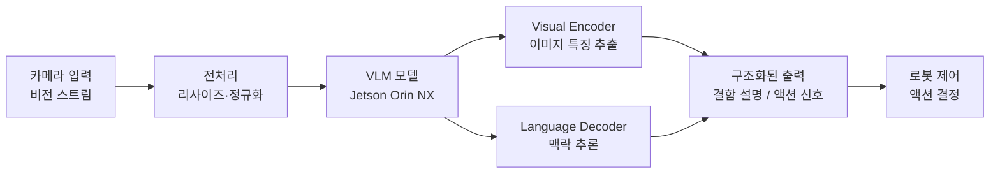

# CS3 · VLM/VLA Edge 추론 — Jetson Orin NX에서 멀티모달 AI 검증

> **핵심 메시지**: 차세대 제조 로봇이 "맥락"을 이해하려면, 먼저 Edge에서 가능한지 증명해야 한다.

---

## 요약

| 항목 | 내용 |
|---|---|
| **환경** | NVIDIA Jetson Orin NX (Edge SoC) |
| **목표** | VLM/VLA 모델의 Edge 실시간 추론 가능성 검증 |
| **범위** | 성능 프로파일링, Feature Representation 분석 |
| **성과** | Edge 환경에서 실시간 멀티모달 추론 가능성 확인 |

---

## 1. 상황 (Context)

차세대 제조 로봇은 단순 패턴 매칭을 넘어 **작업 맥락을 이해하는 인지 능력**이 필요합니다.
"이 부품이 잘못 조립됐다"가 아니라, "이 부품이 이 위치에서 이 방향으로 조립될 때 무엇이 문제인가"를
자연어 수준으로 이해하는 VLM(Vision Language Model) / VLA(Vision Language Action) 기술의 선행 연구를 수행했습니다.

핵심 질문: **Jetson Orin NX라는 Edge SoC에서 VLM이 라인 사이클타임 내에 구동될 수 있는가?**

---

## 2. 검증 아키텍처 (Action)

**프로파일링 측정 항목**:

| 측정 항목 | 측정 방법 |
|---|---|
| End-to-end 지연시간 | 입력 프레임 → 출력까지 타임스탬프 |
| Visual Encoder 처리 시간 | 모듈별 분리 측정 |
| Language Decoder TTFT | Time To First Token |
| GPU 메모리 사용량 | tegrastats 실시간 수집 |
| 정확도 vs 지연시간 트레이드오프 | 양자화 수준별 비교 |

---

## 3. 핵심 발견 (Findings)

!!! success "가능성 확인"
    Jetson Orin NX에서 경량화된 VLM 모델의 실시간 추론이 **기술적으로 가능함**을 확인.
    Visual Encoder 부분은 사이클타임 내 처리 가능하며, Language Decoder는 배치 처리 또는
    비동기 파이프라인 설계로 라인 흐름에 통합 가능.

!!! info "Feature Representation 분석"
    VLM의 중간 Feature Map을 분석한 결과, 기존 YOLO 기반 검출 모델이 놓치는
    **공간적 맥락 정보(부품 간 관계, 조립 방향성)** 를 효과적으로 인코딩함을 확인.

---

## 4. 성과 (Result)

| 항목 | 결과 |
|---|---|
| Edge 실시간 추론 가능성 | **확인** |
| 차세대 아키텍처 적용 기반 | **마련** |
| 기존 YOLO 대비 맥락 이해 능력 | **유의미한 향상 확인** |

---

## 5. 의의 및 한계

**의의**: 단순 검출 모델(YOLO)에서 맥락 이해 모델(VLM)로의 전환 가능성을 Edge에서 최초 검증.
제조 라인의 "설명 가능한 AI 비전" 구현을 위한 선행 기술 로드맵을 마련.

**현재 한계**: 완전한 양산 적용을 위해서는 추가적인 경량화(Quantization, Pruning), 
전용 NPU 가속 최적화, 현장 데이터 기반 Fine-tuning이 필요.

---

## 핵심 학습

!!! note "엔지니어링 원칙"
    선행 연구의 가치는 "된다/안 된다"의 이진 결론이 아니라,
    "어느 부분이 병목이고, 어느 부분은 지금 당장 쓸 수 있는가"를 정량적으로 분리해내는 것에 있다.
