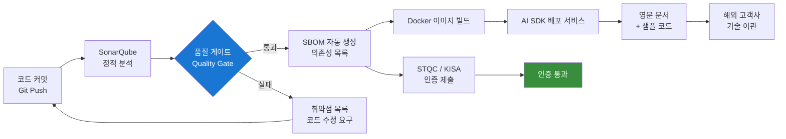

# CS4 · 글로벌 양산 수준의 SW 품질 및 보안 관리

> **핵심 메시지**: 현장에서 신뢰받는 시스템은 코드 품질과 보안이 측정 가능해야 한다.

---

## 요약

| 항목 | 내용 |
|---|---|
| **환경** | 국방·공공 납품 제품 (STQC, KISA 인증 대응) |
| **목표** | 글로벌 양산 수준의 SW 품질 게이트 + 보안 인증 기반 마련 |
| **해결** | SonarQube 정적 분석, SBOM 생성, AI SDK 영문 문서화 + 배포 서비스 |
| **성과** | 대외 인증 통과, 기술 지원 효율성 증대 |

---

## 1. 상황 (Context)

Edge AI 제품을 국방·공공 분야에 납품하기 위해서는 국제 보안 인증(STQC, KISA) 준수가 필수였습니다.
동시에 해외 고객사에게 AI SDK를 기술 이관하기 위한 **영문 문서화 및 배포 서비스 체계**도 구축해야 했습니다.

두 가지 요구 모두 "코드가 동작한다"를 넘어 **"코드가 안전하고 신뢰할 수 있으며, 유지보수 가능함"** 을 증명해야 하는 과제였습니다.

---

## 2. 구축한 파이프라인 (Action)

---

## 3. 세부 구현

### SonarQube 정적 분석

- C/C++ 및 Python 코드베이스 전체 적용
- 커밋마다 자동 분석 실행 — 취약점·코드 스멜·중복 코드 검출
- Quality Gate 기준 설정: Critical 이슈 0건, 코드 커버리지 임계값 유지

### SBOM (Software Bill of Materials)

- 오픈소스 의존성 전체 목록화: 라이선스·버전·취약점(CVE) 추적
- STQC/KISA 인증 제출용 형식으로 자동 생성

### AI SDK 영문 문서화

- API 레퍼런스, 통합 가이드, 샘플 코드를 영문으로 작성
- 해외 고객사가 자립적으로 통합할 수 있는 배포 서비스 구축
- 기술 지원 인바운드 문의량 감소 확인

---

## 4. 성과 (Result)

| 항목 | 결과 |
|---|---|
| 대외 보안 인증 | STQC, KISA 기반 **인증 통과** |
| Critical 취약점 | Quality Gate 운영 후 **0건 유지** |
| 기술 지원 효율 | 영문 SDK 문서화 후 지원 문의 **감소** |
| 해외 기술 이관 | AI SDK 자립 배포 서비스 **구축 완료** |

---

## 5. 핵심 학습

!!! note "엔지니어링 원칙"
    보안 인증은 결과가 아니라 과정이다.
    SonarQube와 SBOM이 CI 파이프라인에 통합되면, 인증 준비는 코드를 쓰는 매 순간에 이미 진행 중인 것이다.

!!! tip "운영 관점에서의 문서화"
    영문 SDK 문서는 "고객이 질문하지 않아도 되도록" 만드는 것이 목표다.
    기술 지원 문의가 줄어든다는 것은, 문서가 현장에서 실제로 작동하고 있다는 가장 직접적인 증거다.
