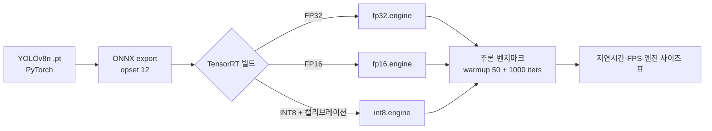

# CS5 · TensorRT 정밀도 트레이드오프 벤치마크

> **핵심 메시지**: FP32 → FP16 → INT8 가속의 정량 측정 — JD의 ONNX/TensorRT 항목을 코드로 증명.

!!! info "방법론 검증 데모"
    실측 환경은 **데스크탑 GPU(RTX 4060)** 입니다. Edge(Jetson) 또는 서버 GPU와 절대 지연시간은 다릅니다.
    FP32 → FP16 → INT8 의 **상대 가속비와 정확도 트레이드오프**는 동일한 패턴을 보입니다.

코드: [`examples/trt-benchmark/`](https://github.com/leeyunhome/portfolio/tree/main/examples/trt-benchmark)

---

## 요약

| 항목 | 내용 |
|---|---|
| **모델** | YOLOv8n (Ultralytics) — 비전 검사 표준 백본 |
| **변환 경로** | PyTorch → ONNX → TensorRT (FP32 / FP16 / INT8) |
| **하드웨어** | NVIDIA RTX 4060 Laptop · CUDA 13.0 · TensorRT 10.x |
| **캘리브레이션** | COCO128 · `IInt8EntropyCalibrator2` (Ultralytics 기본) |

---

## 1. 변환 파이프라인

---

## 2. 벤치마크 결과

<!-- BENCHMARK_TABLE_START -->
> 벤치마크 실행 후 자동으로 채워집니다 (`bench.py` → `benchmark.md`).
<!-- BENCHMARK_TABLE_END -->

---

## 3. 핵심 트레이드오프

| 정밀도 | 가속 메커니즘 | 정확도 손실 (일반론) | 적용 권장 |
|---|---|---|---|
| **FP32** | 기준 — Tensor Core 미사용 | 0 | 디버깅·기준선 |
| **FP16** | Tensor Core 활용 (Ada/Ampere) | < 0.5% mAP | 대부분 양산 적용 가능 |
| **INT8** | INT8 Tensor Core · 양자화 | 0.5 ~ 2% mAP (캘리브 셋 의존) | 사이클타임 압박 시 |

---

## 4. INT8 캘리브레이션 — 실무 포인트

!!! warning "캘리브레이션 셋 선택이 정확도를 결정한다"
    - **현장 분포 대표성**: 라인별 카메라 노출·각도·조도가 캘리브 셋에 포함되어야 함
    - **권장 규모**: 200~500장 (적으면 양자화 스케일이 outlier에 흔들림)
    - **재현성**: 캘리브 셋과 양자화 결과를 함께 버전 관리해야 함 — 재학습 후에도 동일 셋으로 재캘리브

!!! tip "정확도 떨어지는 레이어 핸들링"
    Per-layer FP16 fallback: 민감 레이어(보통 마지막 detection head, 회귀 layer)만 FP16 유지하고
    나머지 INT8. TensorRT의 `ILayer::setPrecision` 으로 layer-wise 설정 가능.

---

## 5. 면접 질문 대응 메모

이 데모를 만들면서 정리한 **TensorRT 깊은 질문 4개 답안**:

??? question "Q1. 왜 FP16에서 보통 정확도 손실이 거의 없는가?"
    뉴럴넷 가중치·활성화 분포의 동적 범위가 FP16의 표현 범위 안에 대체로 들어옴.
    오버플로 위험이 있는 일부 레이어(softmax, exp)는 TensorRT가 자동으로 FP32 fallback을 수행함.

??? question "Q2. INT8 캘리브레이션 데이터는 어떻게 골라야 하는가?"
    현장 카메라의 분포를 대표해야 함. 동일 라인이라도 시간대·조도·이물질 유형이 다르면
    별도 캘리브 셋을 가져가야 함. 라인별 파라미터 템플릿(JD 항목)과 함께 관리.

??? question "Q3. 특정 레이어가 INT8에서 크게 떨어진다면?"
    먼저 per-layer 정확도 추적(TensorRT의 `--verbose` + polygraphy)으로 범인 식별.
    해당 레이어만 `setPrecision(DataType::kHALF)` 로 FP16 유지하는 mixed precision 적용.

??? question "Q4. TensorRT 엔진 파일이 GPU/드라이버에 종속적인 이유?"
    TRT 빌드 시 해당 GPU의 SM 아키텍처와 PTX/사이즈에 최적화된 커널을 미리 선택·컴파일하기 때문.
    배포 환경별 빌드 또는 호환 매트릭스(SM75/SM89 등) 관리 필요.

---

## 6. 양산 적용 시 추가 고려사항

- **DLA 활용** (Jetson AGX/Orin): GPU와 별도 가속기 활용으로 GPU 부담 분산
- **동적 배치(Dynamic Shapes)**: 라인별 입력 해상도 변경 대응
- **엔진 캐싱**: 동일 환경 재빌드 시간 절감 (TRT 빌드는 분 단위)
- **버전 고정**: TRT·CUDA·드라이버 매트릭스 명시 (재현성)
